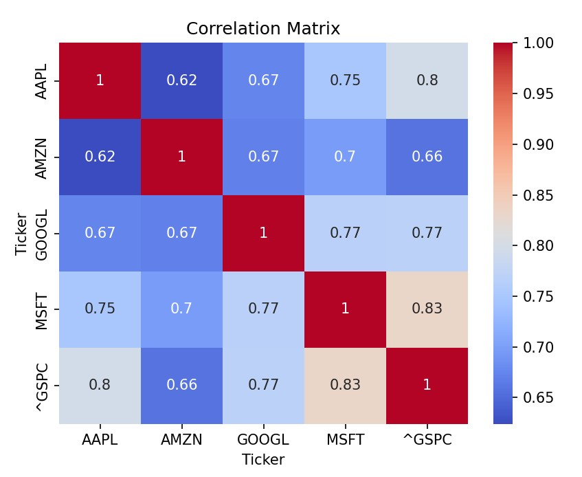
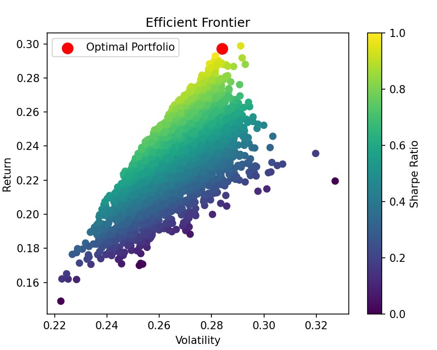
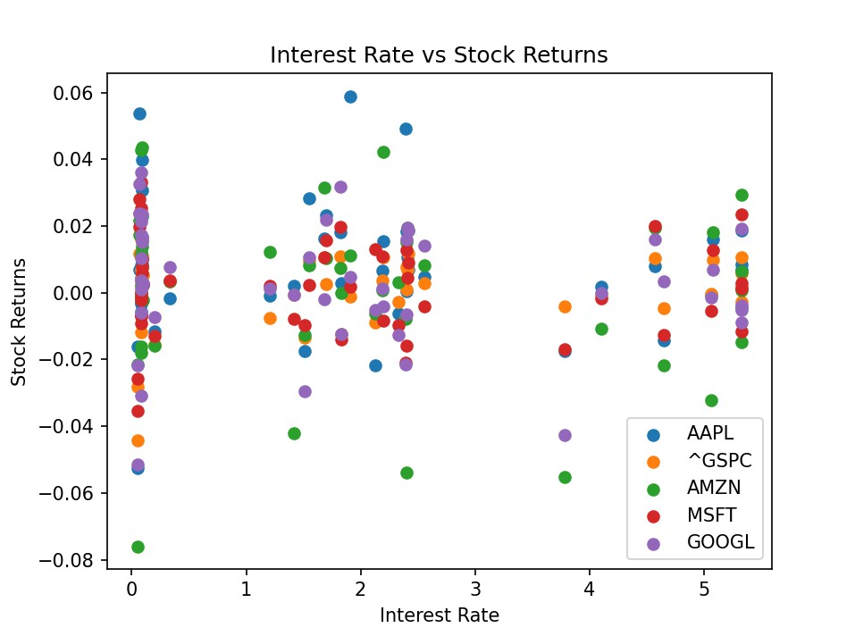

# Portfolio-Optimization-with-Institutional-Data
This project simulates institutional-level investment research by combining equity market data with macroeconomic indicators to construct and optimize a diversified portfolio.

# 📊 Institutional Portfolio Optimization & Macroeconomic Analysis

## 📌 Overview

This project simulates institutional-level investment research by combining equity market data with macroeconomic indicators to construct and optimize a diversified portfolio.

## 🎯 Objectives

* Analyze stock performance across major tech companies
* Evaluate risk-return characteristics
* Incorporate macroeconomic factors (interest rates)
* Optimize portfolio allocation using Monte Carlo simulation
* Identify the portfolio with the highest Sharpe ratio

## 🛠️ Tech Stack

* Python
* Pandas, NumPy
* Matplotlib, Seaborn
* yFinance
* FRED API

## 📊 Key Features

* Financial time series data pipeline
* Risk-return and correlation analysis
* Efficient frontier simulation (5000+ portfolios)
* Optimal portfolio identification
* Macroeconomic integration (interest rates vs returns)

## 📈 Results

### Stock Performance

This chart shows the normalized price movement of selected stocks and the S&P 500 over time, allowing comparison of relative performance.

Insights: 
Tech stocks significantly outperformed the market during growth periods 
Market downturns show synchronized declines across assets 
Benchmark comparison helps evaluate alpha generation

### Correlation Matrix


This heatmap displays correlations between asset returns, highlighting diversification potential.

Insights: 
High correlation among tech stocks reduces diversification benefits 
Inclusion of broader indices helps stabilize portfolio risk 
Correlation spikes during market stress reduce hedging effectiveness

### Efficient Frontier


This plot shows simulated portfolios with varying risk-return profiles, identifying the optimal portfolio using the Sharpe Ratio.

Insights: Optimal portfolio achieves highest return per unit of risk 
Diversification improves efficiency compared to single-asset strategies 
Risk-adjusted performance is more meaningful than raw returns

### Interest Rate Trends


This visualization compares interest rate movements with stock returns to analyze macroeconomic impact.

Insights:

Rising interest rates negatively impact equity valuations 
Macro factors play a critical role in portfolio performance 
Integrating economic indicators improves decision-making robustness


## 🧠 Key Insights

* Higher interest rates show a negative correlation with stock returns
* Diversification benefits are reduced when asset correlations increase
* Optimal portfolio balances risk and return efficiently using Sharpe ratio
* Market benchmark comparison helps evaluate relative performance

## 🚀 How to Run

```bash
pip install -r requirements.txt
python main.py
```

## 💼 Business Impact

This project demonstrates how integrating macroeconomic indicators with financial data can improve portfolio decision-making and risk management strategies.
