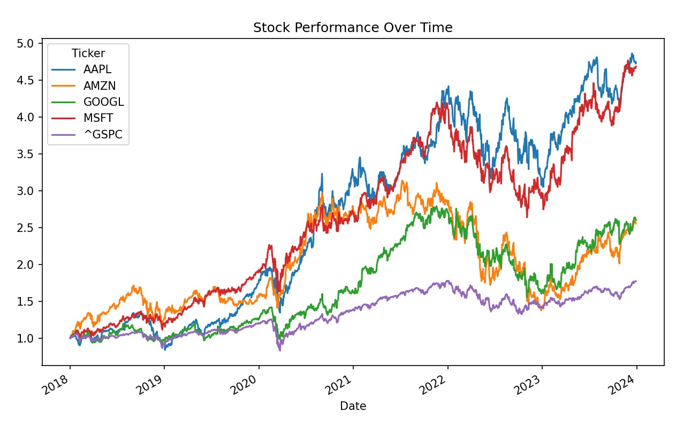

# Portfolio-Optimization-with-Institutional-Data
This project simulates institutional-level investment research by combining equity market data with macroeconomic indicators to construct and optimize a diversified portfolio.

# 📊 Institutional Portfolio Optimization & Macroeconomic Analysis

## 📌 Overview

This project simulates institutional-level investment research by combining equity market data with macroeconomic indicators to construct and optimize a diversified portfolio.

## 🎯 Objectives

* Analyze stock performance across major tech companies
* Evaluate risk-return characteristics
* Incorporate macroeconomic factors (interest rates)
* Optimize portfolio allocation using Monte Carlo simulation
* Identify the portfolio with the highest Sharpe ratio

## 🛠️ Tech Stack

* Python
* Pandas, NumPy
* Matplotlib, Seaborn
* yFinance
* FRED API

## 📊 Key Features

* Financial time series data pipeline
* Risk-return and correlation analysis
* Efficient frontier simulation (5000+ portfolios)
* Optimal portfolio identification
* Macroeconomic integration (interest rates vs returns)

## 📈 Results

### Stock Performance



### Correlation Matrix


### Efficient Frontier


### Interest Rate Trends


## 🧠 Key Insights

* Higher interest rates show a negative correlation with stock returns
* Diversification benefits are reduced when asset correlations increase
* Optimal portfolio balances risk and return efficiently using Sharpe ratio
* Market benchmark comparison helps evaluate relative performance

## 🚀 How to Run

```bash
pip install -r requirements.txt
python main.py
```

## 💼 Business Impact

This project demonstrates how integrating macroeconomic indicators with financial data can improve portfolio decision-making and risk management strategies.
